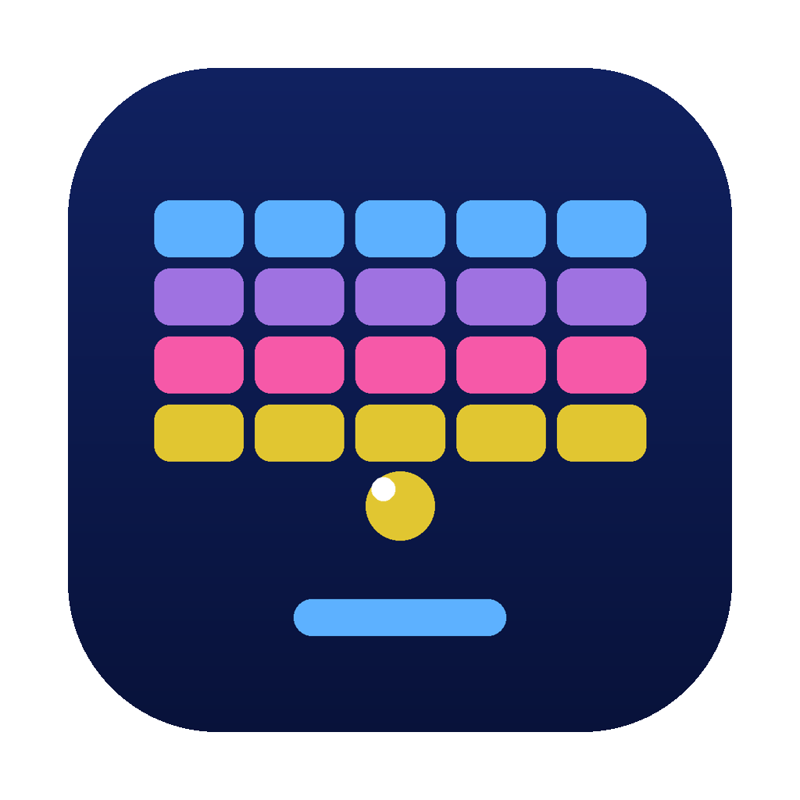
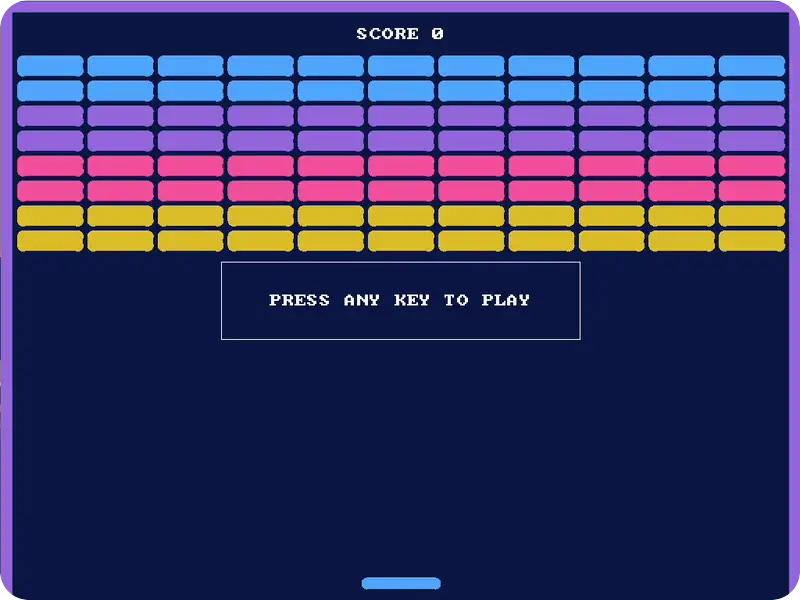
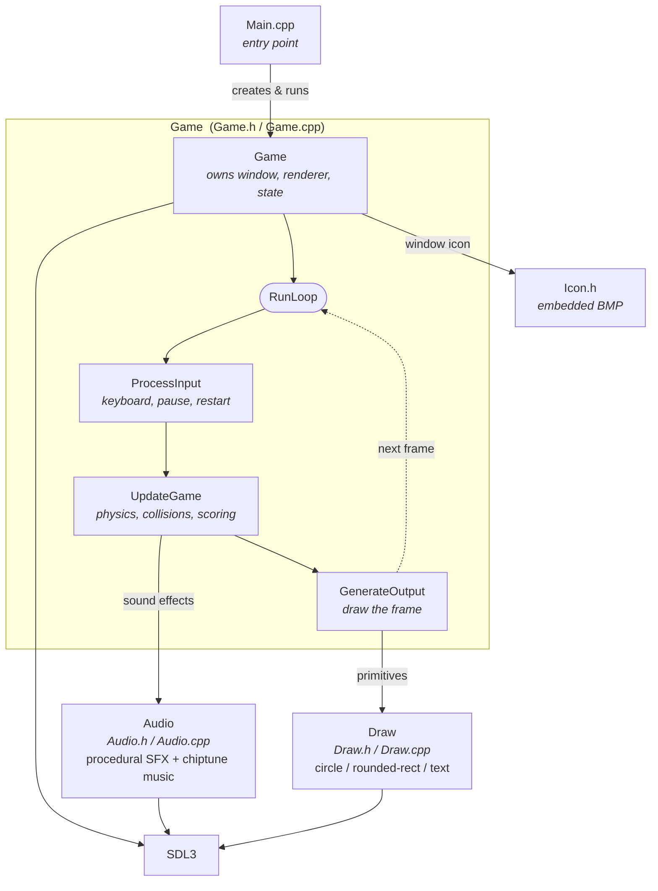

<p align="center">
  
</p>

# Breakout

A small Breakout game built with **SDL3** and modern C++ (RAII), featuring a
bottom paddle with angle-based ball control, a wall of breakable bricks,
endless levels that speed up, procedural sound effects, a looping chiptune
soundtrack, lives, score, and pause.

## Gameplay

<p align="center">
  
</p>

- Move the paddle with **← / →** (or **A / D**).
- Press **any key** on the start screen to launch the ball.
- Bounce the ball into the bricks to break them. **Clear every brick to advance
  to the next level** — each level serves the ball faster. The current level
  shows along the top, between the lives and the score.
- Press **Space** to pause / resume.
- You have **3 lives** (the hearts, top-left). Drop the ball and you lose one —
  press **any key** at the *Continue* prompt to play on; lose all three and it's
  **game over**.
- On the game-over screen, press **Y** to try again or **N** to quit.
- Press **Esc** to quit at any time.

## Project layout

```
.
├── CMakeLists.txt          # Build definition + packaging (CPack)
├── Makefile                # Thin convenience wrapper around CMake
├── include/
│   ├── Game.h              # Game class (RAII-managed SDL resources)
│   ├── Physics.h           # Pure, SDL-free collision/deflection maths
│   ├── Audio.h             # Procedural sound-effects helper
│   ├── Draw.h              # Stateless 2D drawing helpers
│   └── Icon.h              # Window icon, embedded as a byte array (generated)
├── src/
│   ├── Main.cpp            # Entry point
│   ├── Game.cpp            # Game loop, input, simulation, rendering
│   ├── Physics.cpp         # Collision/deflection (unit-tested in isolation)
│   ├── Audio.cpp           # Synthesized SFX + chiptune music (core SDL3 audio)
│   └── Draw.cpp            # Circle / rounded-rect / text primitives
├── tests/
│   └── physics_test.cpp    # Unit tests for Physics (run via CTest)
├── assets/
│   ├── icon.png            # 1024×1024 master icon
│   ├── icon_512.png        # 512×512 icon (Linux desktop / hicolor)
│   ├── icon.icns           # macOS icon (for the .app bundle)
│   ├── icon.ico            # Windows icon (embedded via breakout.rc)
│   ├── breakout.rc         # Windows resource script (icon)
│   ├── breakout.desktop    # Linux desktop entry
│   └── screen_recording.webp # Demo clip used in this README
├── .github/workflows/      # CI: build + package for macOS/Windows/Linux
├── .clang-format           # Formatting style
├── .clang-tidy             # Static-analysis checks
└── build/                  # Out-of-source build output (git-ignored)
```

## Requirements

- A C++20 compiler (clang or gcc)
- [CMake](https://cmake.org) ≥ 3.16
- [SDL3](https://www.libsdl.org/)

On macOS:

```sh
brew install cmake sdl3
```

On Debian/Ubuntu:

```sh
sudo apt install cmake libsdl3-dev
```

## Building & running

Using the convenience wrapper:

```sh
make        # configure + build into build/
make run    # build and launch
make clean  # remove build/
```

Or with CMake directly:

```sh
cmake -S . -B build
cmake --build build
./build/breakout                                   # Linux/Windows
open build/Breakout.app                             # macOS (a .app bundle)
```

> If SDL3 isn't installed system-wide, CMake automatically fetches and builds
> it from source (pinned to `release-3.4.10`), so the build works on a clean
> machine.

## Packaging / distribution

Each platform produces a **self-contained** package — SDL3 is bundled, so the
game runs without a separate SDL install.

```sh
make package      # build a package for the current platform via CPack
```

| Platform | Output | Notes |
|----------|--------|-------|
| macOS    | `Breakout-<ver>-Darwin.dmg` | `Breakout.app` with the `.icns` icon and SDL3 bundled into `Contents/Frameworks` (ad-hoc signed). |
| Windows  | `Breakout-<ver>-Windows.zip` | `breakout.exe` (icon embedded via `assets/breakout.rc`) plus `SDL3.dll`. |
| Linux    | `.tar.gz` (CPack) or an **AppImage** (CI) | AppImage bundles SDL3 and the `.desktop`/icon. |

CI ([`.github/workflows/build.yml`](.github/workflows/build.yml)) builds all
three on every push and uploads them as artifacts; pushing a `v*` tag also
publishes a GitHub Release.

> **macOS note:** packages are ad-hoc signed, not notarized. To share outside
> your own machine without Gatekeeper warnings, sign with a Developer ID and
> notarize.

## Development

```sh
make test          # build and run the unit tests (CTest)
make lint          # clang-tidy static analysis
make format        # apply .clang-format to the sources
make format-check  # verify formatting without editing (CI-friendly)
```

The collision and ball-deflection maths live in `Physics.{h,cpp}` as pure,
SDL-free functions so they can be unit-tested in isolation
([tests/physics_test.cpp](tests/physics_test.cpp)). CI runs the tests (and a
format check) before any platform build, so a release can't ship with failing
tests or unformatted code.

CMake exports `build/compile_commands.json`, which
[clangd](https://clangd.llvm.org/) uses for IntelliSense, inline clang-tidy
diagnostics, and format-on-save.

### Architecture

`Main` constructs a `Game`, which owns the SDL window/renderer and drives the
classic input → update → render loop each frame. The loop delegates rendering to
the stateless `Draw` helpers and sound to the `Audio` module; everything sits on
top of SDL3.



Most of the boxes above are thin wrappers over SDL — window/renderer creation,
event polling, drawing, audio output. The only genuinely game-specific logic
lives in `UpdateGame`, and it comes down to two things: **collision detection**
and **ball direction**.

#### Collision detection

Each frame the ball is advanced by `velocity × deltaTime`, then tested against
everything it could hit:

- **Walls** — the ball is treated as a point. If it crosses the top or a side
  wall the matching velocity component is flipped; crossing the bottom edge ends
  the round. Each test also checks the ball is *moving toward* that wall, so it
  can't get stuck flipping back and forth on the same edge.
- **Paddle** — a hit registers when the ball is within half a paddle-width
  horizontally and within a small band just above the paddle's top while moving
  downward.
- **Bricks** — the ball is treated as a box (its centre ± radius) and overlap
  with each brick is measured on both axes. On a hit it reflects along the axis
  of **least penetration** (so it bounces off the nearest face), the brick is
  destroyed, and the score increases. Only one brick is broken per frame to keep
  the bounce unambiguous.

#### Ball direction

A wall or brick bounce simply negates one velocity component, so speed is
preserved. The paddle is what lets the player *steer*: instead of a plain
vertical flip, the rebound angle is derived from **where** the ball struck the
paddle. The horizontal offset from the paddle's centre maps to an angle from
straight up — centre sends the ball vertical, the edges send it off at up to
`maxBounceAngle` (60°). The ball's speed is recomputed from its current
components and re-applied at the new angle, so aiming changes direction without
changing pace. Capping the angle at 60° guarantees a meaningful vertical
component every time, so the ball can never settle into an endless horizontal
rally.
